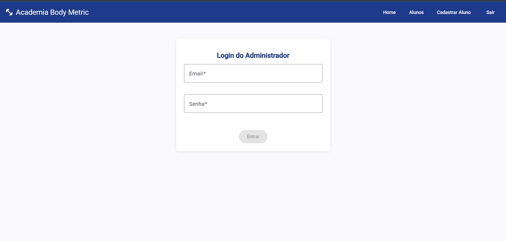
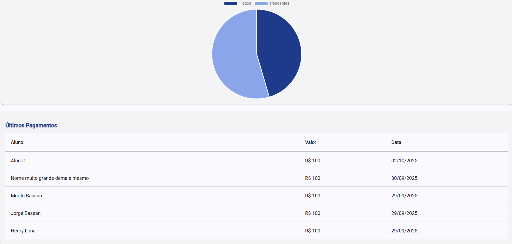
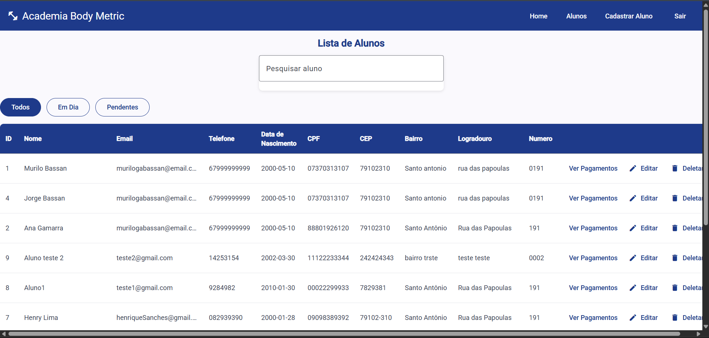
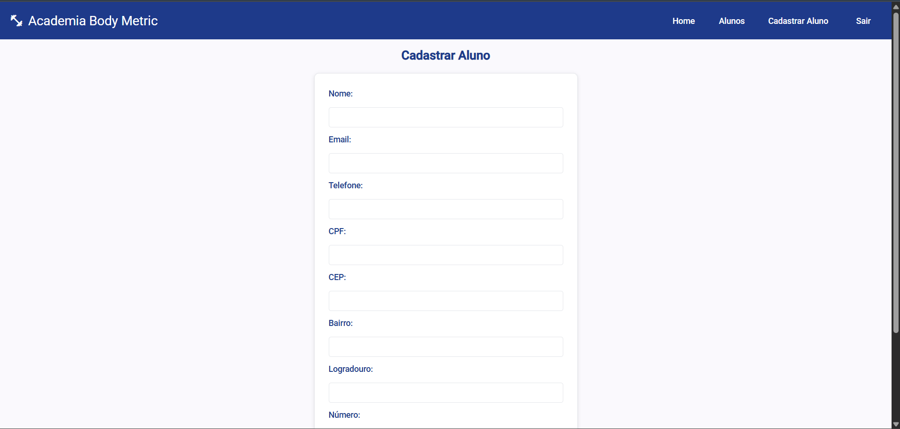
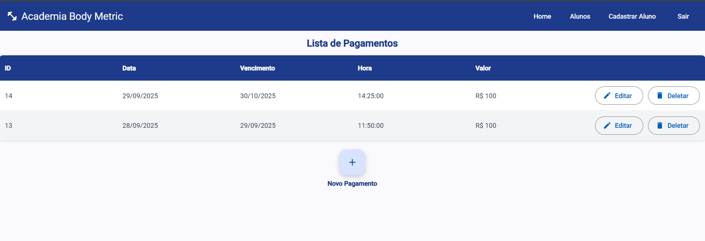
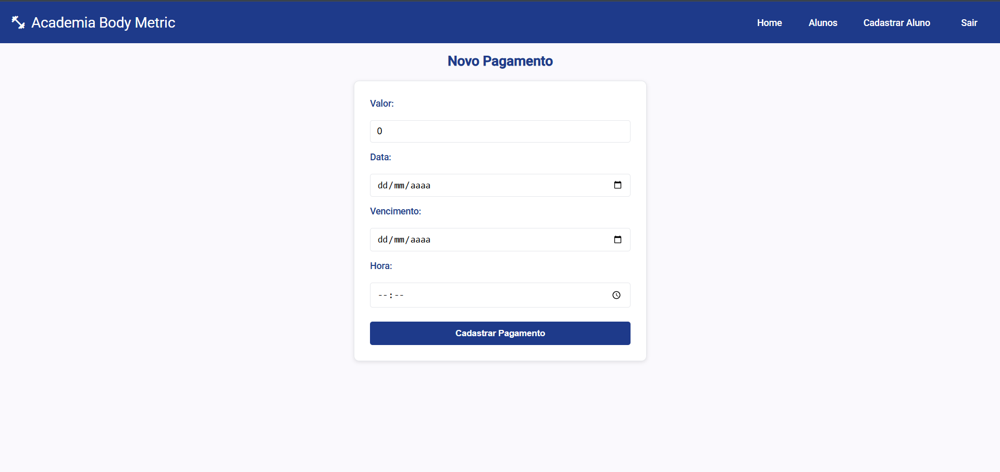
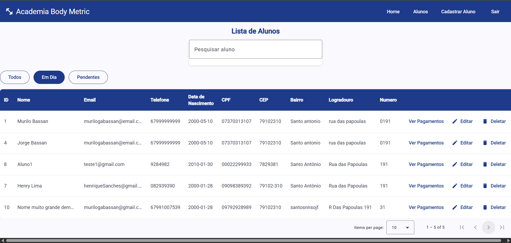
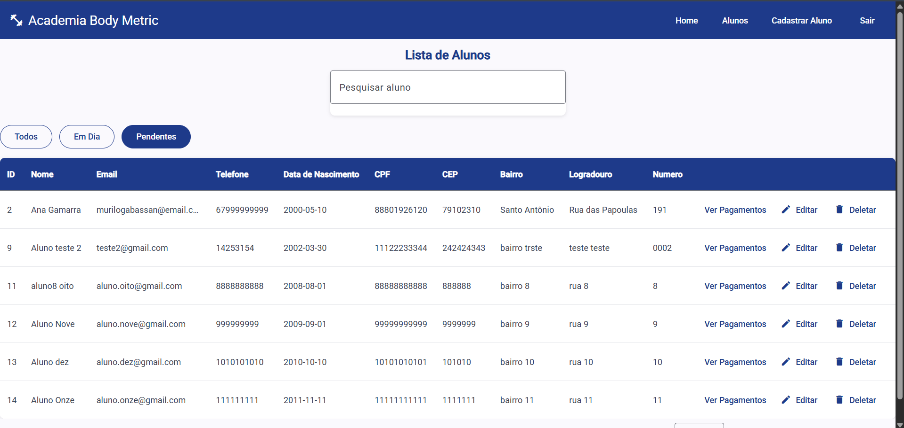
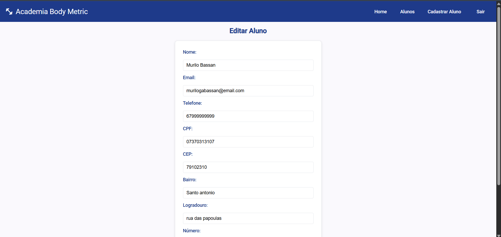
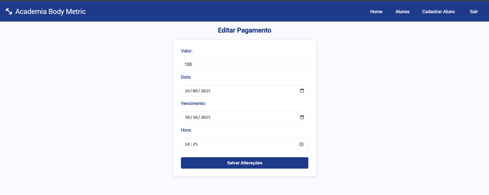

# 📊 Academia Body Metric

Sistema de gestão para academia, com controle de alunos, pagamentos e painel administrativo.

---

## 🚀 Tecnologias
- **Backend:** Spring Boot (Java, Security, JWT, JPA, PostgreSQL)
- **Frontend:** Angular (Standalone Components, Angular Material)
- **Banco de Dados:** PostgreSQL (Supabase)
- **Autenticação:** Login do administrador com JWT
- **Deploy:** (em breve configurado com variáveis de ambiente)

---

## 🔑 Funcionalidades
- Cadastro, edição e listagem de **alunos**
- Cadastro e controle de **pagamentos**
- Dashboard administrativo
- Autenticação com **login JWT** (apenas administrador)
- Interface responsiva com **Angular Material**
- Proteção de rotas no frontend

---

## 🖼️ Capturas de Tela

### Login

### Dashboard

### Lista de Alunos

### Busca de Aluno

### Cadastro de Aluno

### Lista de Pagamentos

### Cadastro de Pagamento

### Filtro Alunos Em Dia

### Filtro Alunos Pendentes

### Editar Aluno

### Editar Pagamento

